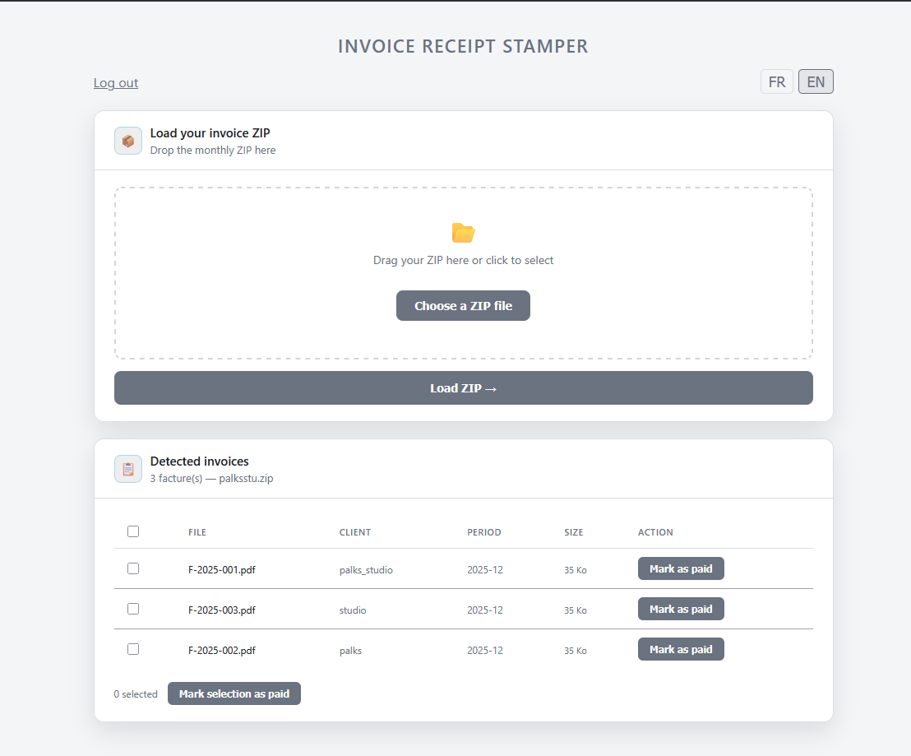

<p align="center">
  
</p>

> 🇬🇧 English | [🇫🇷 Français](./README_FR.md)


<p align="center">
  <a href="https://palks-studio.com">
    
  </a>
</p>

# PDF Invoice Receipt Stamper

> This repository is a technical presentation and documentation repository.  
> It does not contain downloadable source code or production files.

Add-on for the Factur-X EN16931 batch invoicing service. The batch generation engine is available in the [automation_finance](https://github.com/PalksDev/automation_finance) repository.

Password-protected web interface to stamp PDF invoices as "PAID" — one at a time or in bulk, with a client-structured ZIP export.

This tool is designed to be deployed directly within the client's hosting environment.

It allows a payment confirmation stamp to be applied  
to existing PDF invoices and prepares them  
for submission to the batch invoicing service.

---

## Overview

- Monthly ZIP upload via drag & drop  
- Auto-detected invoice list with client, reference and period  
- Single or batch stamping  
- Client-structured ZIP export for direct forwarding  
- Red payment stamp overlaid on the original PDF using FPDI  
- Password-protected interface with brute-force protection  
The engine does not rely on any database.

Files are processed temporarily during the stamping process  
and downloaded immediately.

Depending on the client environment configuration,  
stamped invoices can also be archived  
in a dedicated system directory.
---

## Requirements

- PHP 8.0+  
- PHP extensions:  
  - `zip`  
  - `mbstring`  
- Composer

---

## Installation

**1. Clone or upload the file to your server**

```bash
cd /var/www/your-folder
```


**2. Install dependencies**

```bash
composer require setasign/fpdi setasign/fpdf
```


**3. Configure**

At the top of `acquittement.php`, update the two constants:

```php
define('ACCESS_PASSWORD', 'your_password');
define('TMP_DIR', __DIR__ . '/tmp_acquittement');
```


The `tmp_acquittement/` directory is created automatically on first access.

---

## How it works

**Single stamp**  
Click **"Mark as paid"** next to an invoice, enter the payment date, download the stamped PDF.

**Batch stamp**  
Select multiple invoices or use **"Select all"**, click **"Mark selection as paid"**, enter a shared payment date.  
A ZIP is generated with all stamped PDFs, structured by client reference:  

```
paid_invoices.zip
  clientRef/
    F-2025-001_PAID.pdf
    F-2025-002_PAID.pdf
```


**The original file is never modified.** The stamp is applied to a copy generated on the fly and deleted after download.

---

## Dependencies

| Library                                           | Usage                              |
|---------------------------------------------------|------------------------------------|
| [setasign/fpdi](https://github.com/Setasign/FPDI) | Read and annotate the original PDF |
| [setasign/fpdf](https://github.com/Setasign/FPDF) | PDF generation                     |
| [JSZip](https://stuk.github.io/jszip/)            | Client-side ZIP generation (CDN)   |

---

## Security

- Password authentication with brute-force protection (10 attempts max)  
- Secure session (`httponly`, `secure`, `SameSite=Strict`)  
- Path traversal protection on file paths  
- Strict payment date validation  
- Temporary files deleted after each download  
- `X-Content-Type-Options: nosniff` header  
- `Cache-Control: no-store`

---

## Context

This engine is an add-on to the Factur-X EN16931 batch invoicing service by [Palks Studio](https://palks-studio.com). It is designed to be deployed once on the client's server, with no dependency on the main batch engine after installation.

---

© Palks Studio — see LICENSE.md  
https://palks-studio.com
