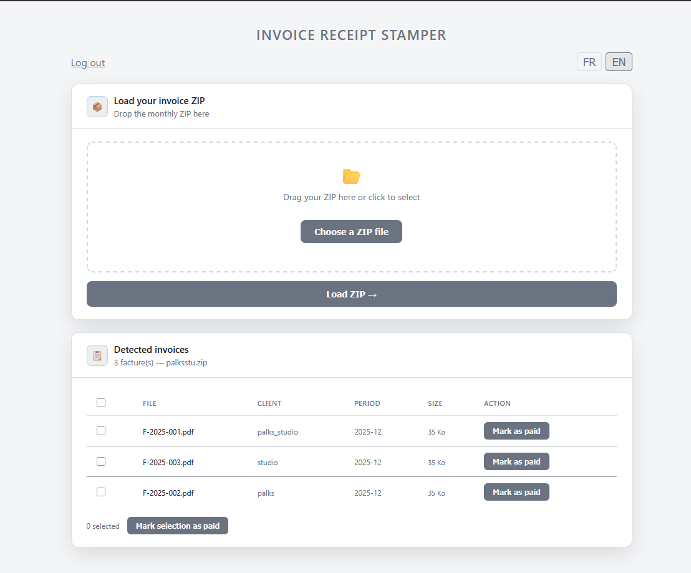

<p align="center">
  
</p>

> 🇬🇧 English | [🇫🇷 Français](./README_FR.md)


[](https://palks-studio.com/en/invoice-stamper)

<p align="center">
  <a href="https://palks-studio.com">
    
  </a>
</p>

# PDF Invoice Receipt Stamper

> This repository is a technical presentation and documentation repository.  
> It does not contain downloadable source code or production files.

Add-on for the Factur-X EN16931 batch invoicing service. The batch generation engine is available in the [automation_finance](https://github.com/PalksDev/automation_finance) repository.

Password-protected web interface to stamp PDF invoices as "PAID" — one at a time or in bulk, with a client-structured ZIP export.

This tool is designed to be deployed directly within the client's environment.

It allows a payment confirmation stamp to be applied to existing PDF invoices and prepares them  
for submission to the batch invoicing service.

[](https://palks-studio.com/en/invoice-stamper)

*This link points to the standalone Invoice Stamper, not the batch invoicing add-on.*

---

## Overview

- Monthly ZIP upload via drag & drop  
- Direct PDF stamping without ZIP — accepts any PDF file  
- Auto-detected invoice list with client, reference and period  
- Single or batch stamping  
- Client-structured ZIP export for direct forwarding  
- Red stamp overlaid on the original PDF via FPDI  
- Password-protected interface with brute-force protection

No database is used.

Files are processed temporarily during the stamping process and downloaded immediately.

Depending on the client environment configuration, stamped invoices can also be archived  
in a dedicated system directory.

Optional archiving remains entirely local to the client environment.

The engine distinguishes between:  

- temporary files used during ZIP extraction and PDF generation  
- paid invoice archives stored separately when this feature is enabled

No database is used for document retention.

---

# Invoice Stamper — Project Structure

```
invoice-stamper/
│
├── temp_runtime/       → Temporary folder used for ZIP extraction and PDF generation
│   └── .htaccess       → Blocks direct access to the temporary folder from the web
│
├── vendor/             → Composer dependencies required by the PDF engine (FPDI / FPDF libraries)
├── paid_archives/      → Archive of paid invoices generated from batch mode
├── direct_archives/    → Archive of paid PDFs generated from direct mode
├── logs/               → Error logs
│
├── access.php          → Web interface accessible from the browser (loads the internal engine)
├── stamper-engine.php  → Main application engine (authentication, ZIP processing, PDF generation)
├── .htaccess           → Server rules preventing direct access to internal engine files
├── LICENSE.md          → Software license provided by Palks Studio
└── docs/
    └── README.md       → Client documentation explaining how to use the engine
```


YouTube:
https://www.youtube.com/watch?v=bV1k9jVrZ88

*This link points to the standalone Invoice Stamper, not the batch invoicing add-on.*

---

## Requirements

- PHP 8.0+  
- PHP extensions:  
  - `zip`  
  - `mbstring`  
- Composer

---

## Deployment

This tool is designed to be deployed directly within the client’s environment.

No public installation procedure is provided.

---

## How it works

**Direct PDF stamp**  
Drop any individual PDF file into the dedicated section, enter the payment date, download the stamped PDF immediately. This function accepts any PDF — it is not limited to invoices issued by the batch billing service.

**Single stamp**  
Click "Mark as paid" next to an invoice, enter the payment date, download the stamped PDF.

**Batch stamp**  
Check multiple invoices or use "Select all", click "Mark selection as paid", enter a shared payment date. A ZIP is generated with all stamped PDFs, structured by client reference:

```
factures_acquittees.zip
  clientRef/
    F-2025-001_ACQUITTEE.pdf
    F-2025-002_ACQUITTEE.pdf
```


**The original file is never modified.**

The stamp is applied to a generated copy of the PDF.

Depending on the deployment configuration, this generated copy may also be automatically archived on the server.

Generated paid PDFs are intended to serve as visual proof of payment.

The engine does not guarantee the preservation of embedded Factur-X XML data in processed PDF files.

---

## Dependencies

| Library                                           | Usage                              |
|---------------------------------------------------|------------------------------------|
| [setasign/fpdi](https://github.com/Setasign/FPDI) | Read and annotate the original PDF |
| [setasign/fpdf](https://github.com/Setasign/FPDF) | PDF generation                     |
| [JSZip](https://stuk.github.io/jszip/)            | Client-side ZIP generation         |

---

## Security

- Password authentication with brute-force protection  
- Secure session management  
- Protection against unauthorized file access  
- Strict validation of payment data  
- Temporary files removed after processing  
- HTTP response security policies (content type, caching, indexing)

---

## Context

This engine is an add-on to the Factur-X EN16931 batch invoicing service by [Palks Studio](https://palks-studio.com). It is designed to be deployed once on the client's server, with no dependency on the main batch engine after installation.

---

© Palks Studio — see LICENSE.md  
https://palks-studio.com
