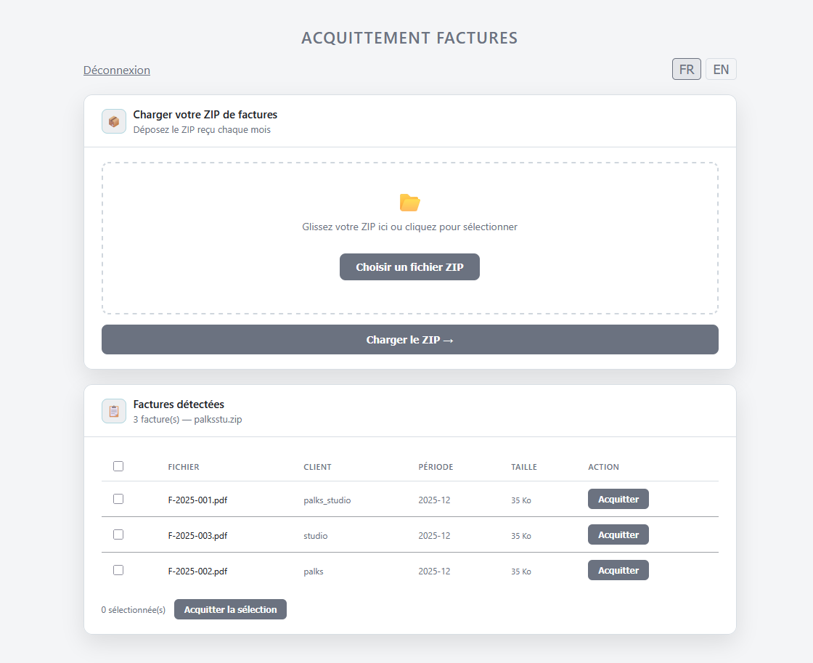

<p align="center">
  
</p>

> 🇫🇷 Français | [🇬🇧 English](./README.md)


[](https://palks-studio.com/fr/facturation-batch-facturx)

<p align="center">
  <a href="https://palks-studio.com">
    
  </a>
</p>

# Moteur d'acquittement de factures PDF

> Ce dépôt constitue une présentation technique et une documentation du projet.  
> Il ne contient pas de code source téléchargeable ni de fichiers de production.

Addon au service de facturation batch Factur-X EN16931. Le moteur de génération batch est disponible dans le dépôt [automation_finance](https://github.com/PalksDev/automation_finance).

Interface web protégée permettant d'apposer un tampon rouge « ACQUITTEE » sur les factures PDF reçues chaque mois, à l'unité ou en lot avec export ZIP structuré par client.

Cet outil est conçu pour être déployé directement  
dans l’environnement du client.

Il permet d’apposer un tampon d’acquittement  
sur des factures PDF existantes et de préparer  
leur envoi au service de facturation batch.

[](https://palks-studio.com/fr/facturation-batch-facturx)

---

## Aperçu

- Upload du ZIP mensuel par glisser-déposer  
- Liste des factures détectées avec client, référence et période  
- Acquittement à l'unité ou sélection multiple  
- Export ZIP structuré par client pour envoi direct  
- Tampon rouge superposé sur le PDF original via FPDI  
- Interface sécurisée par mot de passe, session anti-brute force  
- Aucune base de données n’est utilisée.

Les fichiers sont traités temporairement lors de l’acquittement,  
puis téléchargés immédiatement.

Selon la configuration de l’environnement client,  
les factures acquittées peuvent également être archivées  
dans un dossier dédié du système.

---

## Prérequis

- PHP 8.0+  
- Extensions PHP :  
  - `zip`  
  - `mbstring`  
- Composer

---

## Installation

**1. Cloner ou déposer le fichier sur votre hébergement**

```bash
cd /var/www/votre-dossier
```


**2. Installer les dépendances**

```bash
composer require setasign/fpdi setasign/fpdf
```


**3. Configurer**

En haut du fichier `acquittement.php`, modifier les deux constantes :

```php
define('ACCESS_PASSWORD', 'votre_mot_de_passe');
define('TMP_DIR', __DIR__ . '/tmp_acquittement');
```


Le dossier `tmp_acquittement/` est créé automatiquement au premier accès.

---

## Fonctionnement

**Acquittement à l'unité**  
Cliquez sur « Acquitter » en face d'une facture, indiquez la date de paiement, téléchargez le PDF avec tampon.

**Acquittement groupé**  
Cochez plusieurs factures ou utilisez « Tout sélectionner », cliquez sur « Acquitter la sélection », indiquez une date commune. Un ZIP est généré avec les PDFs acquittés, structurés par référence client :

```
factures_acquittees.zip
  clientRef/
    F-2025-001_ACQUITTEE.pdf
    F-2025-002_ACQUITTEE.pdf
```


**Le fichier original n'est jamais modifié.** Le tampon est appliqué sur une copie générée à la volée et supprimée après téléchargement.

---

## Dépendances

| Librairie                                         | Usage                                 |
|---------------------------------------------------|---------------------------------------|
| [setasign/fpdi](https://github.com/Setasign/FPDI) | Lecture et annotation du PDF original |
| [setasign/fpdf](https://github.com/Setasign/FPDF) | Génération PDF                        |
| [JSZip](https://stuk.github.io/jszip/)            | Génération du ZIP côté client (CDN)   |

---

## Sécurité

- Authentification par mot de passe avec protection anti-brute force (10 tentatives max)  
- Session sécurisée (`httponly`, `secure`, `SameSite=Strict`)  
- Protection path traversal sur les chemins de fichiers  
- Validation stricte de la date de paiement  
- Fichiers temporaires supprimés après chaque téléchargement  
- Header `X-Content-Type-Options: nosniff`  
- `Cache-Control: no-store`

---

## Contexte

Ce moteur est un addon au service de facturation batch Factur-X EN16931 de [Palks Studio](https://palks-studio.com). Il est conçu pour être livré en one shot chez le client, sans dépendance au service principal après installation.

---

© Palks Studio — voir LICENSE.md  
- https://palks-studio.com
