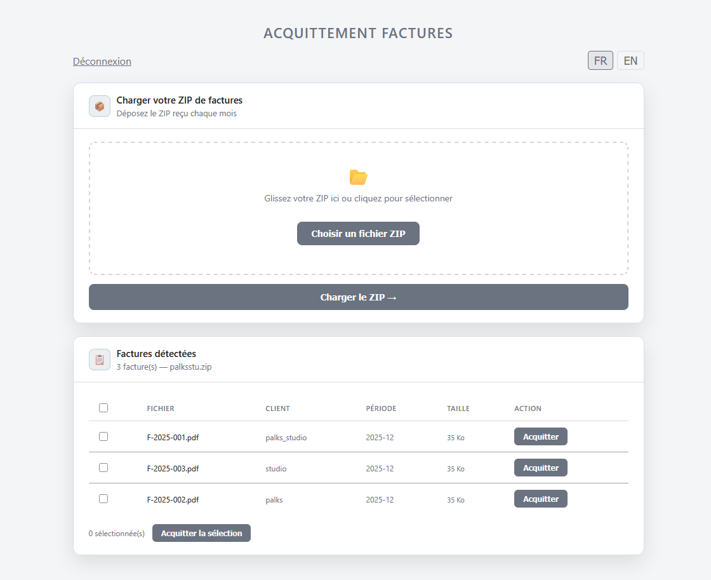

<p align="center">
  
</p>

> 🇫🇷 Français | [🇬🇧 English](./README.md)


[](https://www.youtube.com/@Palks_Studio)
[](https://www.linkedin.com/in/palks-studio/)
[](https://palks-studio.com/fr/invoice-stamper)

<p align="center">
  <a href="https://palks-studio.com">
    
  </a>
</p>

# Moteur d'acquittement de factures PDF

> Ce dépôt constitue une présentation technique et une documentation du projet.  
> Il ne contient pas de code source téléchargeable ni de fichiers de production.

Addon au service de facturation batch Factur-X EN16931. Le moteur de génération batch est disponible dans le dépôt [automation_finance](https://github.com/PalksDev/automation_finance).

Interface web protégée permettant d'apposer un tampon rouge « ACQUITTEE » sur les factures PDF reçues chaque mois, à l'unité ou en lot avec export ZIP structuré par client.

Cet outil est conçu pour être déployé directement dans l’environnement du client.

Il permet d’apposer un tampon d’acquittement sur des factures PDF existantes et de préparer  
leur envoi au service de facturation batch.

[](https://palks-studio.com/fr/invoice-stamper)

*Ce lien renvoie vers la version autonome d'Invoice Stamper, et non vers le module complémentaire de facturation batch.*

---

## Aperçu

- Upload du ZIP mensuel par glisser-déposer  
- Tampon PDF direct sans ZIP — accepte n'importe quel fichier PDF  
- Liste des factures détectées avec client, référence et période  
- Acquittement à l'unité ou sélection multiple  
- Export ZIP structuré par client pour envoi direct  
- Tampon rouge superposé sur le PDF original via FPDI  
- Interface sécurisée par mot de passe, session anti-brute force  
- Aucune base de données n’est utilisée.

Les fichiers sont traités temporairement lors de l’acquittement, puis téléchargés immédiatement.

Selon la configuration de l’environnement client, les factures acquittées peuvent également être archivées  
dans un dossier dédié du système.

L’archivage éventuel reste entièrement local à l’environnement du client.

Le moteur distingue :  

- les fichiers temporaires utilisés pendant le traitement des ZIPs et la génération PDF  
- les archives acquittées conservées séparément lorsque cette fonctionnalité est activée

Aucune base de données n’est utilisée pour la conservation des documents.

---

## Structure du projet

```
invoice-stamper/
│
├── temp_runtime/       → Dossier temporaire utilisé pour l'extraction des ZIP et la génération des PDFs
│   └── .htaccess       → Bloque l'accès direct au dossier temporaire depuis le web
│
├── vendor/             → Dépendances Composer nécessaires au moteur PDF (bibliothèques FPDI / FPDF)
├── paid_archives/      → Archivage des factures acquittées issues du mode batch
├── direct_archives/    → Archivage des PDFs acquittés issus du mode direct
├── logs/               → Journaux d'erreurs
│
├── access.php          → Interface web accessible depuis le navigateur (charge le moteur interne)
├── stamper-engine.php  → Moteur principal de l'application (authentification, traitement ZIP, génération PDF)
├── .htaccess           → Règles serveur empêchant l'accès direct aux fichiers internes du moteur
├── LICENCE.md          → Licence d'utilisation du logiciel fournie par Palks Studio
└── docs/
    └── README_FR.md    → Documentation client expliquant l'utilisation du moteur
```


YouTube :
https://www.youtube.com/watch?v=bV1k9jVrZ88

*Ce lien renvoie vers la version autonome d'Invoice Stamper, et non vers le module complémentaire de facturation batch.*

---

## Prérequis

- PHP 8.0+  
- Extensions PHP :  
  - `zip`  
  - `mbstring`  
- Composer

---

## Déploiement

Cet outil est conçu pour être déployé directement dans l’environnement du client.

Aucune procédure d’installation publique n’est fournie.

---

## Fonctionnement

**Tampon PDF direct**  
Déposez directement un fichier PDF individuel dans la section dédiée, indiquez la date de paiement, téléchargez immédiatement le PDF tamponné. Cette fonction accepte n'importe quel PDF — elle n'est pas limitée aux factures issues du service batch.

**Acquittement à l'unité**  
Cliquez sur « Acquitter » en face d'une facture, indiquez la date de paiement, téléchargez le PDF avec tampon.

**Acquittement groupé**  
Cochez plusieurs factures ou utilisez « Tout sélectionner », cliquez sur « Acquitter la sélection », indiquez une date commune. Un ZIP est généré avec les PDFs acquittés, structurés par référence client :

```
factures_acquittees.zip
  clientRef/
    F-2025-001_ACQUITTEE.pdf
    F-2025-002_ACQUITTEE.pdf
```


**Le fichier original n'est jamais modifié.**

Le tampon est appliqué sur une copie générée à la volée.

Selon la configuration du déploiement, cette copie peut également être archivée automatiquement côté serveur.

Les PDFs acquittés générés sont destinés à servir de justificatifs visuels de paiement.

Le moteur ne garantit pas la conservation des données XML Factur-X embarquées dans les fichiers PDF retraités.

---

## Dépendances

| Librairie                                         | Usage                                 |
|---------------------------------------------------|---------------------------------------|
| [setasign/fpdi](https://github.com/Setasign/FPDI) | Lecture et annotation du PDF original |
| [setasign/fpdf](https://github.com/Setasign/FPDF) | Génération PDF                        |
| [JSZip](https://stuk.github.io/jszip/)            | Génération du ZIP côté client (CDN)   |

---

## Sécurité

- Authentification par mot de passe avec protection contre les tentatives de brute force  
- Gestion sécurisée des sessions  
- Protection contre les accès non autorisés aux fichiers  
- Validation stricte des données de paiement  
- Fichiers temporaires supprimés après traitement  
- Politique de sécurité des réponses HTTP (type, cache, indexation)

---

## Contexte

Ce moteur est un addon au service de facturation batch Factur-X EN16931 de [Palks Studio](https://palks-studio.com). Il est conçu pour être livré en one shot chez le client, sans dépendance au service principal après installation.

---

© Palks Studio — voir LICENSE.md  
- https://palks-studio.com
